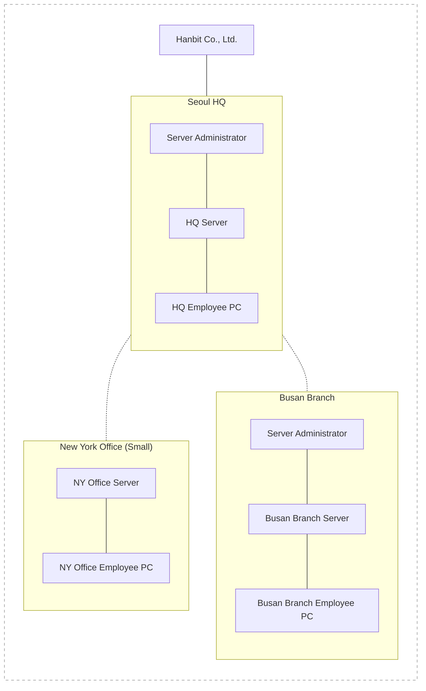
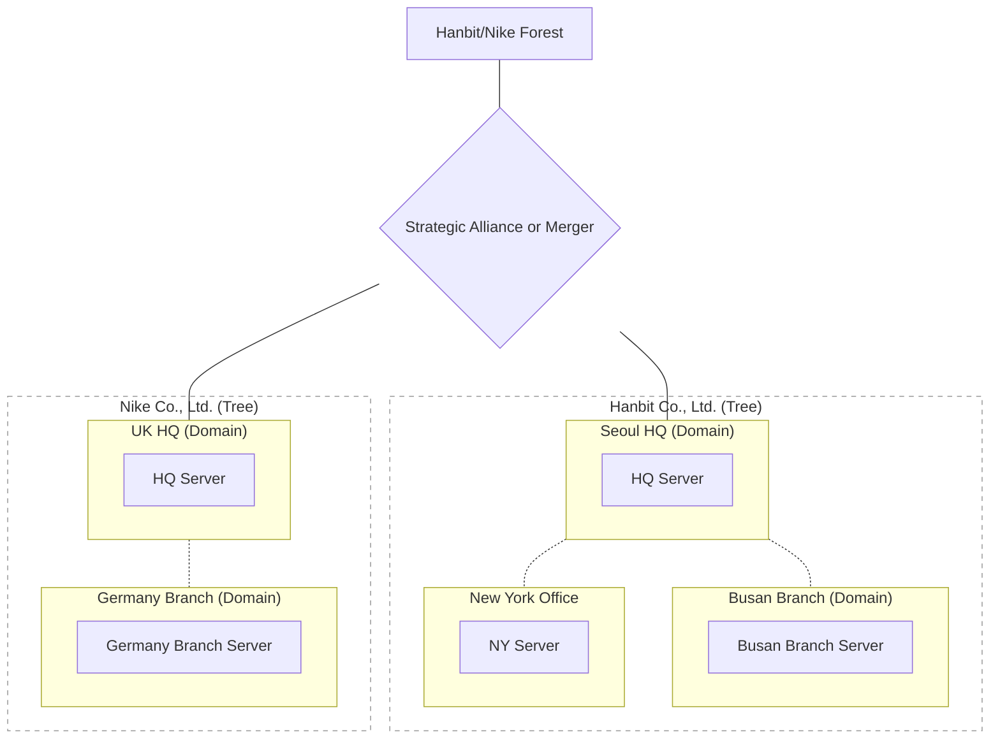

  Windows Server Free Youtube Hands on Video Lectures

https://www.youtube.com/watch?v=bXKNf1SKZh4&list=PLVsNizTWUw7Gcqhpike1hyLcrrwrr0pFt&index=56&t=12s

Introduction to Active Directory

## Active Directory Overview (p. 635)

* Technology to implement the network environment of a typical (somewhat sized) company in Windows Server.
* By having a central administrator integrate and manage multiple resources divided over the network, employees in the headquarters and branch offices no longer need to keep all information on their own PCs.
* Even when traveling to another branch office, as long as you log in with your own ID, another person's PC changes to be just like your own PC environment.
* Conveniently use the resources of the entire company anywhere in the company regardless of where the PC is located.

---

## Active Directory Terminology (1) (p. 637)

* **Directory Service**
  * An environment that integrates distributed network-related resource information into a central repository. That is, users can "automatically" obtain information about desired network resources through the central repository and access those resources.
* **Active Directory (AD)**
  * The implementation of Directory Service in Windows Server.
* **Active Directory Domain Service (AD DS)**
  * Stores information about computers, users, and other peripheral devices on the network and enables administrators to integrate and manage this information.

---

## Active Directory Terminology (2) (p. 638)

* **Domain**
  * The most basic unit of Active Directory. The Seoul HQ and Busan Branch in [Figure 14-1] can each be seen as a single domain.
* **Tree and Forest**
  * Tree is a collection of domains. Forest consists of two or more trees.
  * Relationship: Domain < Tree ≤ Forest

---

## Active Directory Terminology (3) (p. 639)

* **Site**
  * If a domain is a logical category, a site is a physical category. A site can be seen as a group that is geographically separated and has a different IP address range.
* **Trust**
  * Used to represent a relationship of trust between domains or forests.
* **Organizational Unit (OU)**
  * Dividing into detailed units within a domain (e.g., department unit).

---

## Active Directory Terminology (4) (p. 640)

* **Domain Controller (DC)**
  * A server computer that handles login, authorization verification, registering new users, password changes, groups, etc. Install one or more DCs in a domain.
* **Read Only Domain Controller (RODC)**
  * Receives data from the primary domain controller and stores it for use, but does not add or change data on its own. Useful when operated on a small scale making it difficult to have a separate server administrator.
* **Global Catalog (GC)**
  * An integrated repository that collects and stores information about objects contained in domains within a trust.

