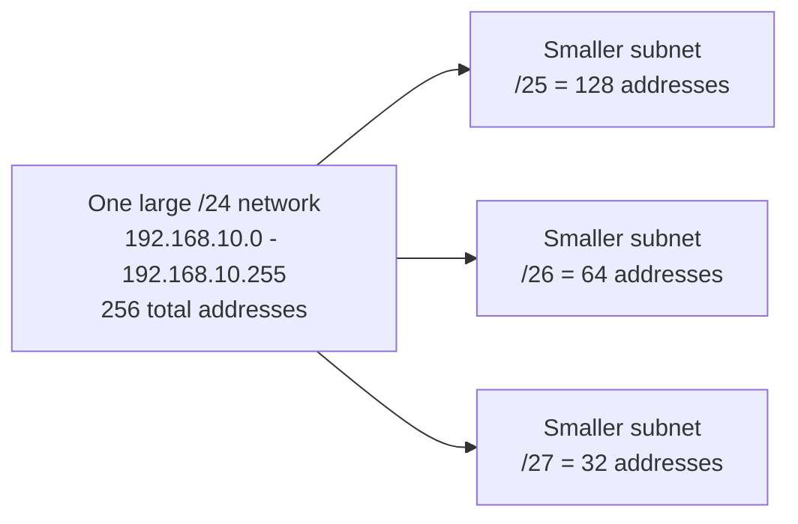
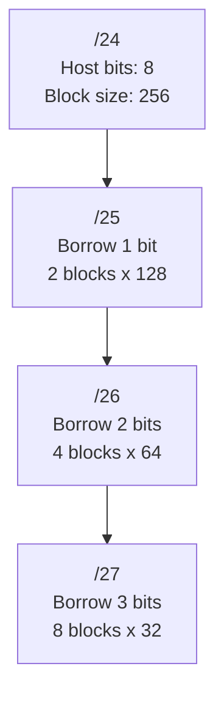
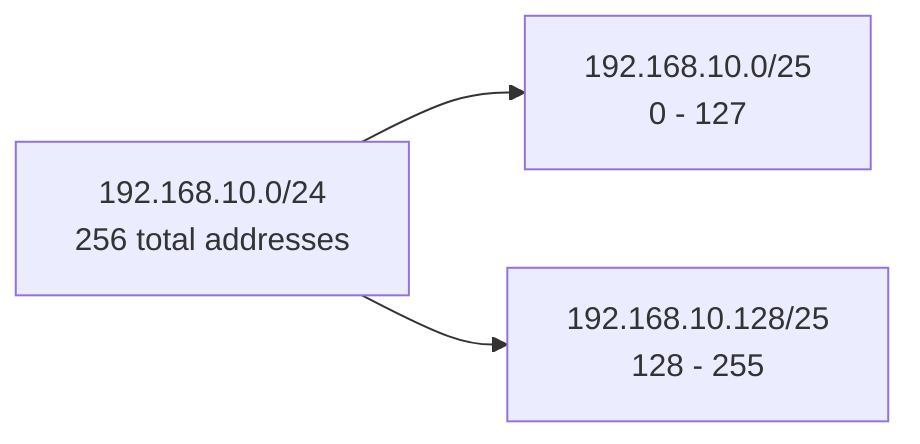
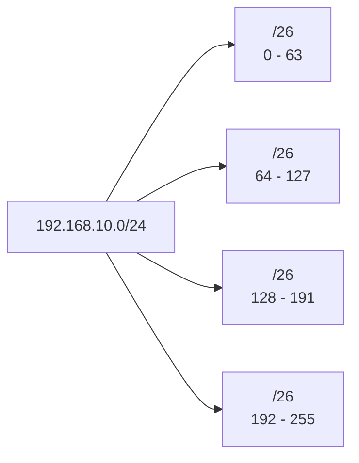
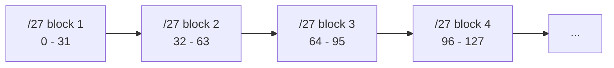
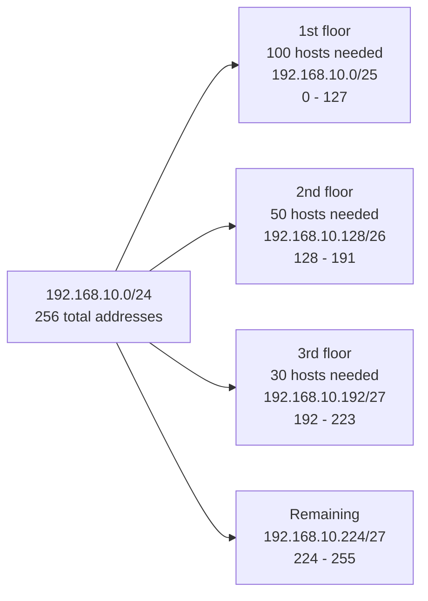

<details markdown="1">
<summary><strong>Network Fundamentals and Operation</strong></summary>

### Basic Network Devices

An **end system** is a device located at the edge of a network, such as a PC or a server. It is the device that actually sends and receives data.

A **switch** connects end systems inside the same local area network (LAN). It checks the MAC address in an incoming frame and decides which port should receive the frame.

A **router** connects different networks. It uses the destination IP address to choose the best path and forwards packets according to its routing table.

### How a Switch Works

The key address used by a switch is the **MAC address**. When a switch receives data, it learns the source MAC address and checks the destination MAC address to decide where to forward the frame.

1. **Learning**
   - The switch records the **source MAC address** of the received data in its MAC address table.
   - For example, if a PC sends data through port `Fa0/1`, the switch remembers that the PC's MAC address is reachable through `Fa0/1`.

2. **Forwarding**
   - The switch checks the **destination MAC address** in the MAC address table.
   - If the destination MAC address is already in the table, the switch forwards the frame only through the correct port.
   - This improves network efficiency because the switch does not send the frame to unnecessary ports.

3. **Flooding**
   - If the destination MAC address is not in the MAC address table, the switch forwards the frame out all ports except the port that received it.
   - This happens when the switch has not yet learned the destination device.

In short, a switch forwards data inside a LAN based on its **MAC address table**. At first, flooding may happen because the switch does not know every address yet. As communication continues, the MAC address table fills up and forwarding becomes more precise.

### How a Router Works

The key address used by a router is the **IP address**. A switch forwards frames inside a LAN using MAC addresses, while a router forwards packets between different networks using IP addresses.

1. **Routing**
   - Routes are added to the routing table through static routing or dynamic routing.
   - Static routing is configured manually by an administrator.
   - Dynamic routing allows routers to exchange routing information and learn paths automatically.

2. **Packet Switching**
   - The router checks the **destination IP address** of the received packet.
   - It forwards the packet according to the path listed in the routing table.

### How Hosts Receive IP Addresses

A host needs an IP address before it can communicate on a network. There are two common ways to assign an IP address.

**Static configuration** means the user or administrator manually enters the IP address, subnet mask, and default gateway. This is often used for servers or network devices that should keep the same address.

**Dynamic configuration** means the host receives an IP address automatically from a DHCP server. This is useful for regular PCs and laptops because it makes address management easier.

### Encapsulation and De-Encapsulation

**Encapsulation** is the process of adding headers to data so it can travel across the network. As data moves down the network layers, headers such as TCP/UDP, IP, and Ethernet headers are added.

**De-encapsulation** is the reverse process. The receiving device removes headers step by step until it reaches the original data.

Packet Tracer is helpful because I can visually see that devices do not simply send raw data. Each layer adds or removes information as the packet moves through the network.

### Practice Screenshot


<p style="font-size: 14px; text-align: center; color: #666;">
  My first network topology created in Packet Tracer
</p>

### Router Interface Configuration Flow

For the router to connect both networks, each router interface needs an IP address and must be enabled.

```text
Router> enable
Router# configure terminal

Router(config)# interface fastEthernet 0/0
Router(config-if)# ip address 192.168.10.1 255.255.255.0
Router(config-if)# no shutdown

Router(config-if)# exit
Router(config)# interface fastEthernet 0/1
Router(config-if)# ip address 192.168.20.1 255.255.255.0
Router(config-if)# no shutdown
```

The `no shutdown` command turns on the interface. In Packet Tracer, if the triangle near the router port is red, the interface may be shut down or the link may not be fully active yet. After setting the IP address, entering `no shutdown` activates the port.

### Important Host Settings

Each PC or server needs the correct IP address, subnet mask, and default gateway.

Inside the same LAN, the switch forwards traffic based on MAC addresses. However, when a host needs to reach a different LAN, it sends the packet to its default gateway. If the default gateway is wrong, communication with other networks will fail.

For example, if the PC `192.168.10.100` wants to reach `192.168.20.100`, the traffic follows this path:

```text
192.168.10.100
-> 192.168.10.1 gateway
-> router
-> 192.168.20.0/24 network
-> 192.168.20.100
```

### Verification Commands

After finishing the configuration, I can verify the router status with these commands:

```text
Router# show ip interface brief
Router# show running-config
Router# show ip route
```

- `show ip interface brief`: checks each interface IP address and up/down status
- `show running-config`: checks the current active configuration
- `show ip route`: checks the networks known by the router

Finally, I can use `ping` from a PC to verify communication between different networks.

```text
ping 192.168.20.100
```

### Simulation Screenshot


<p style="font-size: 14px; text-align: center; color: #666;">
  Packet Tracer simulation mode showing ARP and ICMP traffic
</p>

</details>

<details markdown="1">
<summary><strong>VLAN</strong></summary>

Today I reviewed VLAN fundamentals. A **VLAN**, or **Virtual LAN**, is a way to divide one physical switched network into multiple logical networks. Even if devices are connected to the same physical switches, VLANs can separate them as if they were on different networks.

The key idea is:

```text
One VLAN = one broadcast domain = one logical network
```

Traffic that belongs to a specific VLAN is forwarded only through ports that belong to that VLAN. For example, VLAN 10 traffic stays inside VLAN 10, and VLAN 20 traffic stays inside VLAN 20 unless routing is configured between them.

### How VLANs Work

A switch still performs the same basic switching functions: learning, forwarding, and flooding. The difference is that it also checks the **VLAN number**.

When a switch learns a MAC address, it does not only record the MAC address and port. It also records the VLAN ID.

Example MAC address table:

```text
Vlan   Mac Address   Type      Ports
10     AAA           DYNAMIC   Fa0/2
20     BBB           DYNAMIC   Fa0/1
20     CCC           DYNAMIC   Fa0/3
10     DDD           DYNAMIC   Fa0/4
```

This means that the same switch can keep separate forwarding information for different VLANs. A frame in VLAN 10 is forwarded only within VLAN 10. A frame in VLAN 20 is forwarded only within VLAN 20.

### VLAN Range

VLAN ranges are important because some VLAN IDs are reserved.

- VLAN 1 is the default VLAN and cannot be deleted.
- VLANs 2 through 1001 can be added, changed, or deleted.
- VLANs 1002 through 1005 are reserved for Token Ring and FDDI.

### Advantages of VLANs

VLANs reduce unnecessary network traffic because broadcast frames are limited to a smaller broadcast domain. Examples of broadcast traffic include ARP requests and NetBIOS name queries.

VLANs also reduce security risk. If a worm, virus, or noisy broadcast spreads in one VLAN, the damage is more contained because the broadcast does not automatically reach every device in the physical network.

Main benefits:

- Reduced broadcast traffic
- Smaller broadcast domains
- Better logical separation
- Easier network management
- Reduced chance that a broadcast problem affects the entire switched network

### Access Ports

An **access port** carries traffic for a single VLAN. It is usually used for interfaces connected to end devices such as PCs, printers, and servers.


### Trunk Ports

A **trunk port** carries traffic for multiple VLANs over one physical link. Trunk ports are commonly used between switches or between a switch and a router.

Without trunking, separate physical links would be needed for each VLAN. With trunking, VLAN 10 and VLAN 20 traffic can both travel across the same link while still remaining logically separate.

Basic trunk configuration:

```text
Switch# configure terminal
Switch(config)# interface fastEthernet 0/3
Switch(config-if)# switchport mode trunk
```

The switch must be able to identify which VLAN each frame belongs to as it crosses the trunk link. That is the role of a trunking protocol.

### Trunking Protocols

Two trunking protocols were covered:

**IEEE 802.1Q**

802.1Q is the standard trunking protocol. It identifies VLAN traffic by inserting a tag field into the Layer 2 frame header. This tag tells the receiving switch which VLAN the frame belongs to.

**ISL**

ISL is Cisco proprietary. It identifies VLAN traffic by adding an ISL header and ISL FCS around the original frame. It is older and less commonly used than 802.1Q.

</details>

<details markdown="1">
<summary><strong>Subnetting</strong></summary>

Reference lecture: [Network Construction and Operation Week 7_2: Subneting](https://youtu.be/-iMFsDdfoeI?list=PLMDODR7aOT4zOF1UlT9Y8N00_f9Uae3sj)

Today I studied subnetting. **Subnetting** is the process of dividing one large IP network into smaller logical networks. The goal is to use IP addresses more efficiently and to create network sizes that match the number of hosts actually needed.

Classful networks are often too large for real design needs:

- **Class A** networks support a very large host space, roughly 16 million host IDs.
- **Class B** networks support about 65,536 host IDs.
- **Class C** networks support 256 addresses in the host portion.

For example, if a network only needs about 50 hosts, using a full `/24` block with 256 addresses wastes many addresses. Subnetting lets me split that `/24` block into smaller pieces.



### Subnetting Concept

Given this network:

```text
192.168.10.0/24
```

The `/24` prefix means the first 24 bits are the network portion and the last 8 bits are the host portion.

```text
Network portion: 192.168.10
Host portion:    last octet
Address count:   2^8 = 256
```

Subnetting borrows bits from the host portion and uses them as subnet bits. This creates more networks, but each network has fewer host addresses.

```text
/24 -> 8 host bits  -> 256 addresses
/25 -> 7 host bits  -> 128 addresses per subnet
/26 -> 6 host bits  -> 64 addresses per subnet
/27 -> 5 host bits  -> 32 addresses per subnet
```

The practical rule is:

```text
More subnet bits = more subnets
Fewer host bits  = fewer hosts per subnet
```

I can picture the last octet as the part being divided. The more subnet bits I borrow from the host portion, the smaller each subnet becomes.



### /25 Example

If I borrow 1 host bit from `192.168.10.0/24`, the prefix becomes `/25`.

```text
Subnet mask: 255.255.255.128
Block size:  128
```

This creates two subnets:

| Subnet | Network Address | Usable Host Range | Broadcast Address |
|---|---:|---:|---:|
| `192.168.10.0/25` | `192.168.10.0` | `192.168.10.1 - 192.168.10.126` | `192.168.10.127` |
| `192.168.10.128/25` | `192.168.10.128` | `192.168.10.129 - 192.168.10.254` | `192.168.10.255` |



In each subnet, the first address is the network address and the last address is the broadcast address.

```text
192.168.10.0/25
Network address:   192.168.10.0
Usable hosts:      192.168.10.1 - 192.168.10.126
Broadcast address: 192.168.10.127
```

### /26 Example

If I borrow 2 host bits, the prefix becomes `/26`.

```text
Subnet mask: 255.255.255.192
Block size:  64
```

This creates four subnets:

| Subnet | Network Address | Usable Host Range | Broadcast Address |
|---|---:|---:|---:|
| `192.168.10.0/26` | `192.168.10.0` | `192.168.10.1 - 192.168.10.62` | `192.168.10.63` |
| `192.168.10.64/26` | `192.168.10.64` | `192.168.10.65 - 192.168.10.126` | `192.168.10.127` |
| `192.168.10.128/26` | `192.168.10.128` | `192.168.10.129 - 192.168.10.190` | `192.168.10.191` |
| `192.168.10.192/26` | `192.168.10.192` | `192.168.10.193 - 192.168.10.254` | `192.168.10.255` |



Each `/26` subnet has 64 total addresses. In normal host assignment, 62 are usable because one address is reserved for the network address and one for the broadcast address.

### /27 Example

If I borrow 3 host bits, the prefix becomes `/27`.

```text
Subnet mask: 255.255.255.224
Block size:  32
```

The first `/27` subnet looks like this:

```text
192.168.10.0/27
Network address:   192.168.10.0
Usable hosts:      192.168.10.1 - 192.168.10.30
Broadcast address: 192.168.10.31
```

The next subnet starts at `192.168.10.32`, then `192.168.10.64`, then `192.168.10.96`, and so on.



### Subnetting Design Example

The lecture example divides `192.168.10.0/24` for different floor requirements:

```text
1st floor: 100 hosts
2nd floor: 50 hosts
3rd floor: 30 hosts
```

I should choose the subnet size based on the required number of hosts.

For 100 hosts:

```text
2^7 = 128 addresses
Host ID bits = 7
Prefix = /25
Subnet mask = 255.255.255.128
```

For 50 hosts:

```text
2^6 = 64 addresses
Host ID bits = 6
Prefix = /26
Subnet mask = 255.255.255.192
```

For 30 hosts:

```text
2^5 = 32 addresses
Host ID bits = 5
Prefix = /27
Subnet mask = 255.255.255.224
```

A clean allocation can be:

| Area | Host Need | Chosen Prefix | Address Range | Usable Host Range |
|---|---:|---:|---:|---:|
| 1st floor | 100 | `/25` | `192.168.10.0 - 192.168.10.127` | `192.168.10.1 - 192.168.10.126` |
| 2nd floor | 50 | `/26` | `192.168.10.128 - 192.168.10.191` | `192.168.10.129 - 192.168.10.190` |
| 3rd floor | 30 | `/27` | `192.168.10.192 - 192.168.10.223` | `192.168.10.193 - 192.168.10.222` |
| Remaining space | - | `/27` | `192.168.10.224 - 192.168.10.255` | `192.168.10.225 - 192.168.10.254` |



This is the same logic as VLSM: allocate the largest subnet first, then continue with smaller subnets.

### How to Think About Subnetting

The most useful process for subnetting is:

1. Start with the original network.
2. Decide how many hosts each subnet needs.
3. Find the smallest power of 2 that can cover that host requirement.
4. Convert the host bits into a prefix length.
5. Use the block size to list each network range.
6. Identify the network address, usable host range, and broadcast address.

Quick reference:

```text
/25 -> 128-address blocks -> mask 255.255.255.128
/26 -> 64-address blocks  -> mask 255.255.255.192
/27 -> 32-address blocks  -> mask 255.255.255.224
```

The key takeaway is that subnetting is not just binary math. It is a network design tool that lets me match address space to real requirements.

</details>
